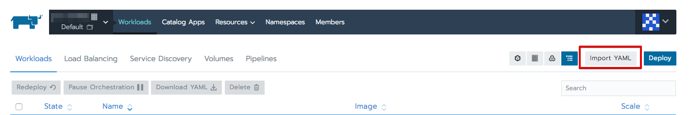
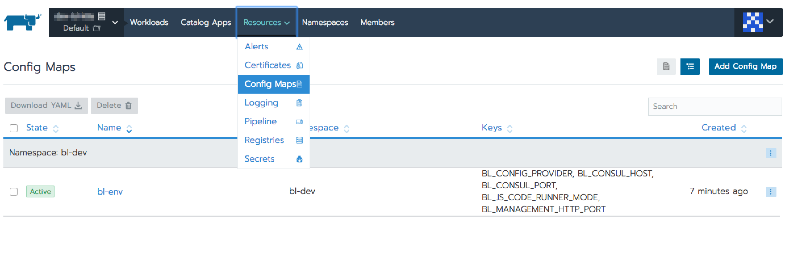

# Services setup

Before setup services, please install and configure following applications:

- rancher in HA mode 

- mysql 5.7 it should contains the following config:
```
character-set-server = utf8mb4
collation-server = utf8mb4_unicode_520_ci
sql-mode = '' # empty
```

#### For Amazon RDS create parameter group and apply following:

```
character_set_server = utf8mb4
collation_server = <leave empty>
sql-mode = NO_ENGINE_SUBSTITUTION 
log_bin_trust_function_creators = 1

```

- redis 4+ redis should be configured with `KEA` https://redis.io/topics/notifications
```
notify-keyspace-events KEA
```
- mongo 3.4.3

###### Note: before import any yml file open it and make sure that there is correct mounts and backendless version

Please follow setup guide step by step in the order that is provided in the doc
- You should have shared file system mounted to all worker nodes
- Initialize mysql DB with the following sql files https://github.com/Backendless/BackendlessPro/tree/master/scripts/mounts/mysql/init
- Add `analytics`, `application_settings`, `push_templates` databases to the mongodb
- [Initialize config map](#init_config_map)
- [bl-consul](services/consul.md)
- [Initialize config values](services/init_config_values.md)
- [bl-hazelcast](services/hazelcast/4.0.x-4.1.x/hazelcast-4.x.md)
- [Change configuration values](../first-configuration.md)
- [Import `bl-server`](services/yml/bl-server.yml)
- [Import `bl-taskman`](services/yml/bl-taskman.yml)
- [Import `bl-coderunner-java`](services/yml/bl-coderunner-java.yml)
- [Import `bl-coderunner-js`](services/yml/bl-coderunner-js.yml)
- [Import `bl-web-console`](services/yml/bl-web-console.yml)
- [Setup RT](../rt.md)
- [Setup domain](#setup_domains)
- [Setup SMTP](#setup_smtp_server)
- [Smoke test](../smoke_test.md)

- [Timer scheduler](services/timer.md)
- Additional steps for [cloud setup](cloud-services-setup.md)


### <a name="init_config_map">Initialize config map</a>
- Press `Import YAML` button

- Copy and paste [config map](services/yml/config-map.yml)
- Press `Import` button

As a result you will able to see your config in the list  


### <a name="setup_domains">Setup domains</a>
- Create domain for API for example `api.my-domain.com` make sure that it is pointed to each k8s node where `bl-server` is running. The domain should be pointed to `32300` port
- Create domain for Backendless console for example `dev.my-domain.com` make sure that it is pointed to each k8s node where `bl-web-console` is running. The domain should be pointed to `32400` port


