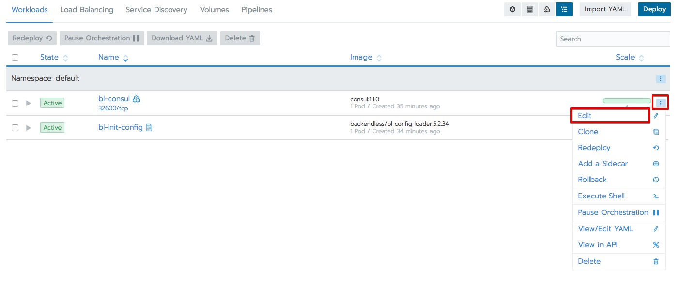
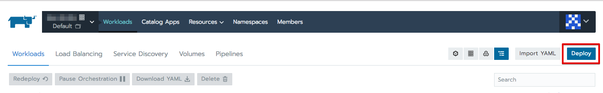
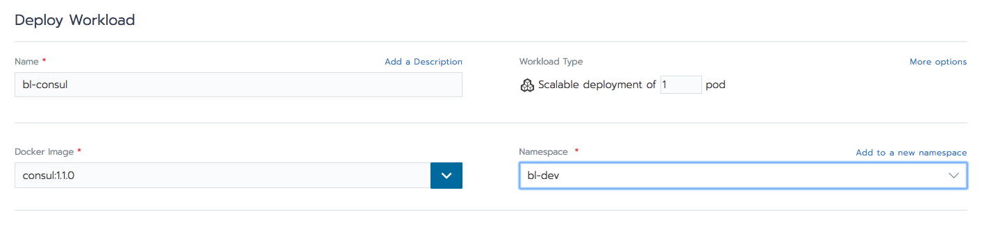
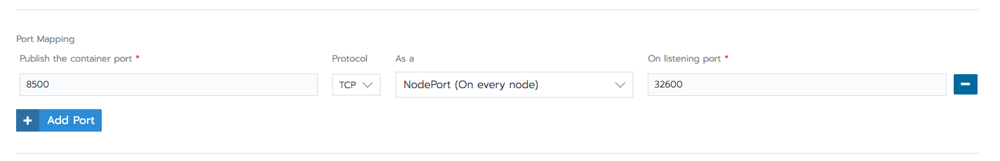
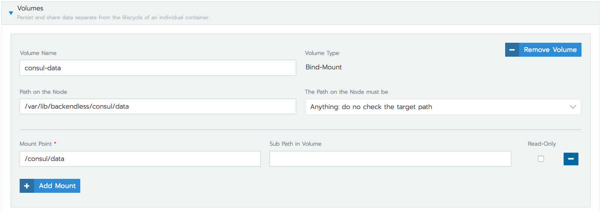
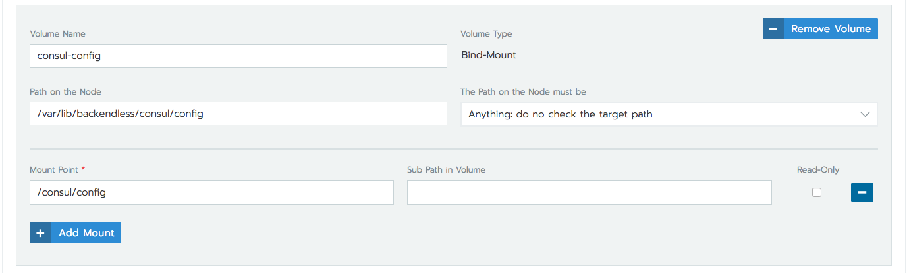
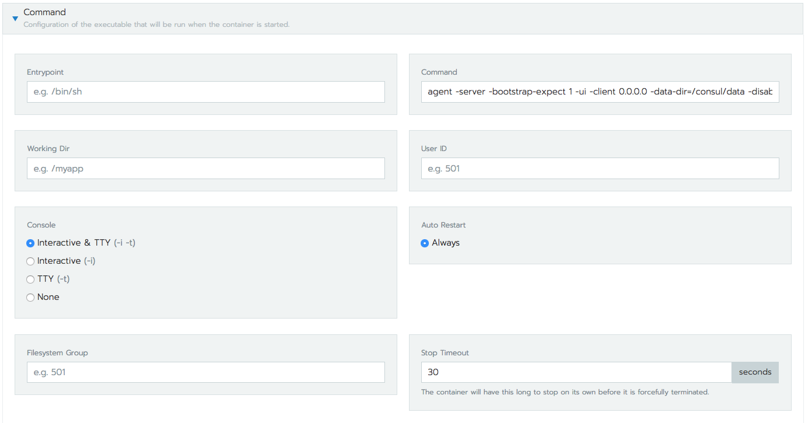
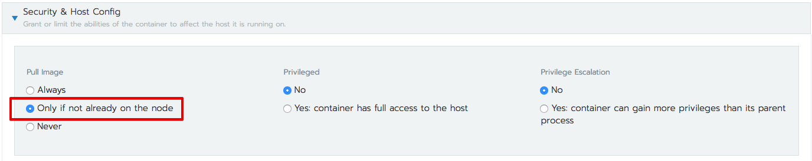
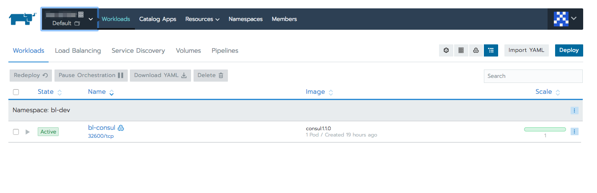
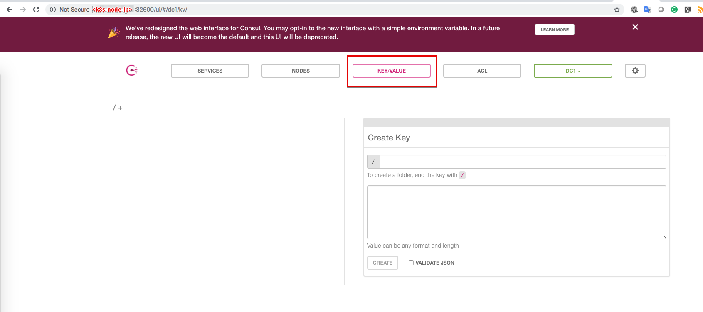

# Setup `bl-consul`
There is two way to setup consul

- [Use yml file](#yml)
- [Setup with rancher UI](#ui)

## <a name="yml">Use yml file</a>
Following steps suppose that you have mounted the shared file system to each k8s node, and mount point is `/var/backendless/fs/`

- Press `Import YAML` button

- Copy and paste [bl-consul](yml/bl-consul.yml) yml file
- Press `Import` button

If you would like to change persistence volume, port, etc press `Edit` button

## <a name="ui">Setup with rancher UI</a>
- Press deploy button 
- Provide name `bl-consul`
- Scalable deployment should be one node
- Use docker image `consul:1.1.0`
- Choose namespace

- Add port mapping. 
  - Port in the container is 8500
  - Protocol: `TCP`
  - Port type should be `NodePort`
  - On listening port is a port that will be available on the host machine, you can choose any. In the current document, we will use 32600 port.
 
- Add two volumes for data and config
  - Data
    - Press `Add Volume..` button and choose `Bind-mount a directory from the node`
    - Provide volume name: `consul-data`
    - Provide `Path on the Node` for example `/var/lib/backendless/consul/data` this folder should be shared for all k8s nodes
    - Provide `Mount Point` it should be `/consul/data`
      
  - Config
    - Press `Add Volume..` button and choose `Bind-mount a directory from the node`
    - Provide volume name: `consul-config`
    - Provide `Path on the Node` for example `/var/lib/backendless/consul/config` this folder should be shared for all k8s nodes
    - Provide `Mount Point` it should be `/consul/config`
    
- Press `Show advanced options` in bottom of the form
- Provide command that will be run when the container is started `agent -server -bootstrap-expect 1 -ui -client 0.0.0.0 -data-dir=/consul/data -disable-host-node-id=true`

- Change `Security & Host Config` Pull Image Only if not already on the node

- Press `Launch` button

---

In both cases, as a result, you will see `bl-consul` service in a list

To get access to the consul you should open port `32600` on k8s nodes

Type IP of any k8s node in the browser and port `32600` and you will able to use consul UI to manage  backendless configuration
  